[toc]

# Predicting Market Trends Using XGBoost

## 1. Introduction

Market timing has always been a fascinating topic to investors around the world. This project uses XGBoost to predict market trends of the Shanghai Stock Exchange Composite Index.  

As XGBoost is a powerful and widely-used tool in supervised machine learning, the first step is to create labels and find features with explanatory and predictive powers regarding the target variables. After the feature engineering step, this project specifies three windows types to fit the historical data by classifying or regression. Finally, a market timing strategy is developed following the triple-barrier-labeling methods, with an annualized Sharpe ratio of 1.29 and an annualized max drawdown ratio of 8.39 %, considering heavy transaction fees. 

## 2. Data Processing

### 2.1 Features and Labels

In terms of labeling, this project uses the triple barrier labeling as described by López (2018). The idea of the triple barrier labeling is to form three boundaries, two horizontal and a vertical one. The horizontal boundaries specify the profit-making and stop-loss limits, while the vertical defines the window length or the expiration limits. If the lower boundary is touched first within the expiration limits, the observation is labeled to be -1, indicating a falling trend. If the upper boundary is touched first, then it is marked 1, showing a rising trend. If neither of the horizontal boundaries is touched, then it is labeled 0 to signal oscillation. In this way, the value of the target variable, 1, -1, and 0, represents three states of the price trend, namely up, down, and oscillation. 

The asset explored in this project is the Shanghai Security Exchange Composite Index (SH0000001). The target variable is the triple barrier label mentioned above. The features include mainly technical variables and some external variables that take the trend of the S&P 500 Index, the SGX FTSE China A50 Index Futures Contract, and the Nanhua Commodity Index into account. 

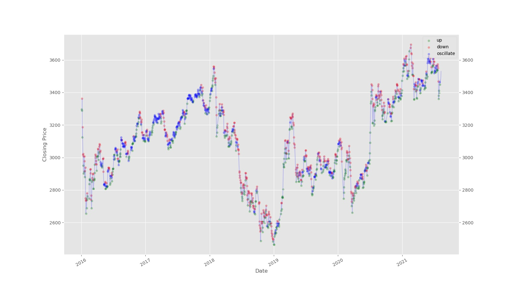

​						Figure 1: triple barrier labeling of the SH000001 index

Figure 1 displays the result of the triple barrier labeling. As can be seen, green dots correspond to the rising states (up), whereas red dots are signals of falling prices (down). The meaning of blue dots seems somewhat ambiguous in the plot, but as the triple barrier method proposes, it represents the oscillation states where the price may go up or move downwards. 

Besides the triple barrier label, another target variable is the next day's closing price. This project uses the `XGBoost Classifier` to predict the triple barrier label, while the `XGBoost Regressor` is used to build the regression model. 

### 2.2 Lagged Features

Compared to another popular tool, LSTM, which is also widely used in time series predictions, it seems that XGBoost cannot consider past information. Lagged features are added based on their correlation with the target variable (either the triple barrier label or the next day's closing price) to overcome this problem. The correlation is computed only using the training set, and only the lagged features that have a relatively higher correlation are selected. 

## 3. Models

### 3.1 Specifications of Windows

Windows split the whole sample period into smaller ones, and a model is trained on each window, enabling the incorporation of new information and parameter updates. This project uses three kinds of windows: fixed windows, rolling windows, and recursive windows.

#### 3.1.1 Single fixed window

A single fixed window is roughly the same as the one-step train-test split. A model is trained on the training set; then, it is used to generate predictions on the test set. One thing that needs attention is that lags are used to avoid data snooping bias. As the label uses future closing prices, the coming five days' closing prices are already known at the end of the training set. To avoid data-snooping issues, these five days should be excluded from the test set. In the case of regression, as the target variable is the next day's closing price, a one-day lag is used between the end of the training set and the beginning of the test set. The structure of the single fixed window is shown in Figure 2.  

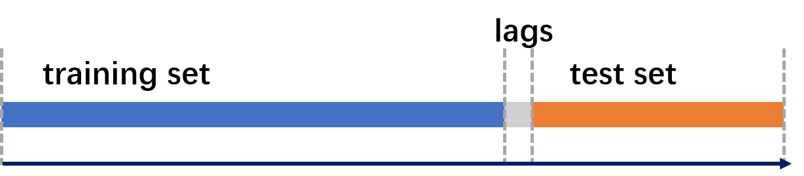

​						Figure 2: one fixed window

#### 3.1.2 Rolling window

The single fixed window can be the essential element of rolling windows and recursive windows. In the setting of a rolling window, as Figure 3 displays, models are re-estimated on each of the windows.  Rolling windows are composed of single fixed windows that move forward. The benefit of a rolling window may be that it allows the parameters to change in a time, therefore incorporating new information.

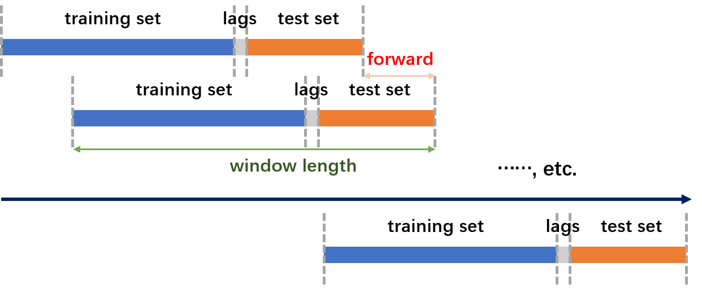

​						Figure 3: rolling window

#### 3.1. 3 Recursive window 

Recursive windows are very similar to rolling ones. The only difference between the two is that the recursive windows expand the training set as time goes by, for all of the windows have the same beginning index of the training set. Figure 4 illustrates those recursive windows. 

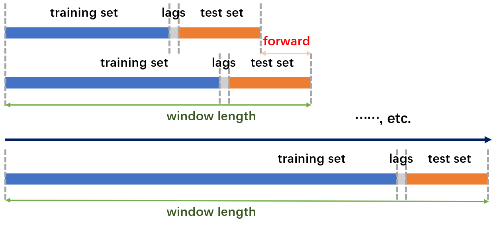

​						Figure 4: recursive window

### 3.2 Parameter Tuning

As XGBoost has many parameters and the tuning process can be very time-consuming, this project only tunes the `num_boost_round`, which denotes the number of trees built in the model. This parameter controls the complexity; as more trees are being built, it is more likely that the model will overfit the training set and adapt poorly to the test data. 

Early-stopping is used to mitigate the overfitting problem by specifying the `early_stopping_rounds` parameter in a k-fold cross-validation. If the hold-out metric does not improve on the validation set for a given number of rounds, the model will stop adding new trees and stop training. The training and validation process is conducted on the training set only.

## 4. Results

### 4.1 XGBoost Classification

Firstly, an XGBoost Classifier is used to predict the triple barrier label. The triple barrier label, which takes the value of -1, 0, and 1, corresponds to the falling, oscillating, and rising states, respectively. 

#### 4.1.1 Single fixed window

Let $M$ be the number of the label's unique values (in this case, three) ; $m$ denotes the label's $m^{th}$ value; $N$ be the number of samples; and $n$ denotes the $n^{th}$ sample. The metric used in the 5-folds cross-validation is the `mlogloss`, specified by the following equation:
$$
mlogloss = -\frac{1}{M}\sum_{m=1}^{M}\frac{1}{N}\sum_{n=1}^{N}(y_{n,m}log(\hat y_{n,m})+(1-y_{n,m})log(1-\hat y_{n,m}))
$$
Figure 5 plots the value of mean `mlogloss` on the training set and validation set. The red vertical line is the best `num_boost_round` chosen by the validation process. As can be seen, the loss function does not decrease well on the test set, suggesting overfitting the training data. 

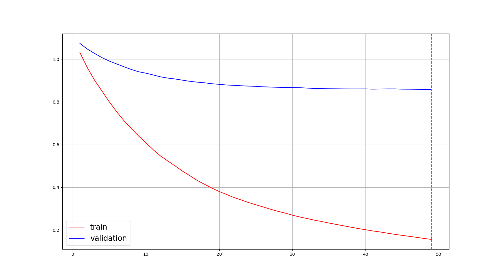

​				Figure 5: mlogloss on the train and validation dataset.

Figure 6 plots the feature importance of the model. Features with higher feature importance are regarded as more useful when making predictions. As can be seen, technical variables like`bias5` and external variables like `SPX_pct` and `north_money` have played a prominent role. 

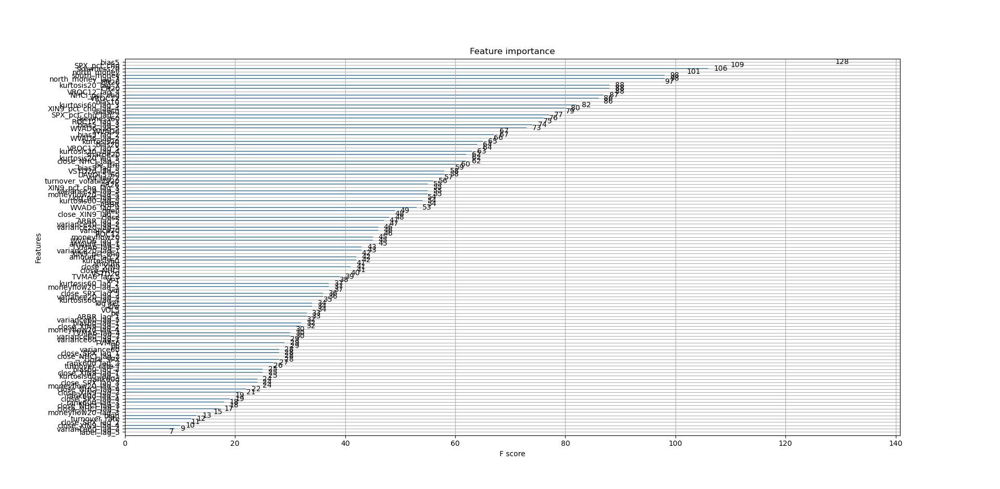

​				Figure 6: feature importance of the model

The results of XGBoost classification using a single fixed window are not satisfying. As shown in figure 7, at the beginning of the test set, the model has given relatively reasonable predictions, where green dots denote up, and blue ones represent oscillation. However, the following forecasts deteriorate quickly as red dots (falling) dominate the results. The model suffers from a severe overfit problem, with an in-sample accuracy of 100.00% and an out-of-sample accuracy of 43.00%.

​				Figure 7: fixed window predictions on the test set

#### 4.1.2 Rolling window

The rolling window specification does not significantly improve the accuracy on the test set, with an in-sample precision of 100.00% on average and an out-of-sample accuracy of 43.22% on average. Figure 8 displays the out-of-sample prediction results. In contrast to figure 1, red dots appear at the rising states, which contradicts its original implication of a falling trend.

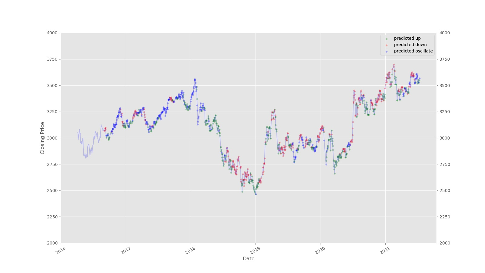

​			Figure 8: rolling window predictions on the test set

#### 4.1.3 Recursive window

The recursive window has a similar performance as the previous two cases. The model has an average in-sample accuracy of 100.00% and an average out-of-sample accuracy of 43.47%. Figure 9 plots the classification results of the test set data. The graph shows that green dots do not appear to be buying points, for some of them cluster at the falling period.

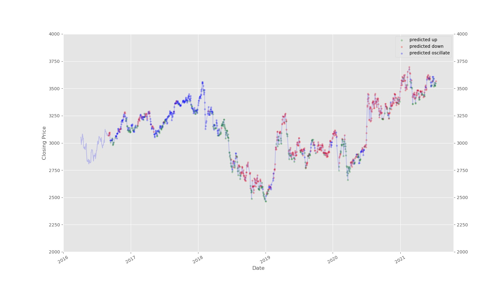

​			Figure 9: recursive window predictions on the test set

As the length of recursive windows increases over time, figure 10 plots the out-of-sample accuracy on every window to inspect whether the window length influences the classification performance. The plots suggest that the performance is not stable across all windows. The out-of-sample accuracy can be as high as 80% and as low as 10%, which is worse than random guesses. 

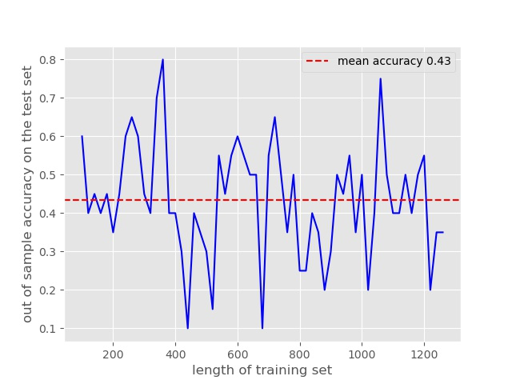

​			Figure 10: out of sample accuracy of each window

### 4.2 XGBoost Regression

As all three forms of classification do not yield satisfying results, XGBoost Regression is used under the assumption that triple barrier labeling may omit useful information of the target variable and increase the intrinsic complexity of the problem. The following part of this report all deals with the regression problem. The target variable is the next day's closing price, and the features and their lagged ones are created in the same way as above. The only difference is that the lag takes one day instead of five days.

#### 4.2.1 Single fixed window

As before, the XGBoost regression is run on a single fixed window, and the best `num_boost_round` is chosen from a five-fold validation with early-stop. Figure 11 plots the rooted mean square error on the train and validation dataset.

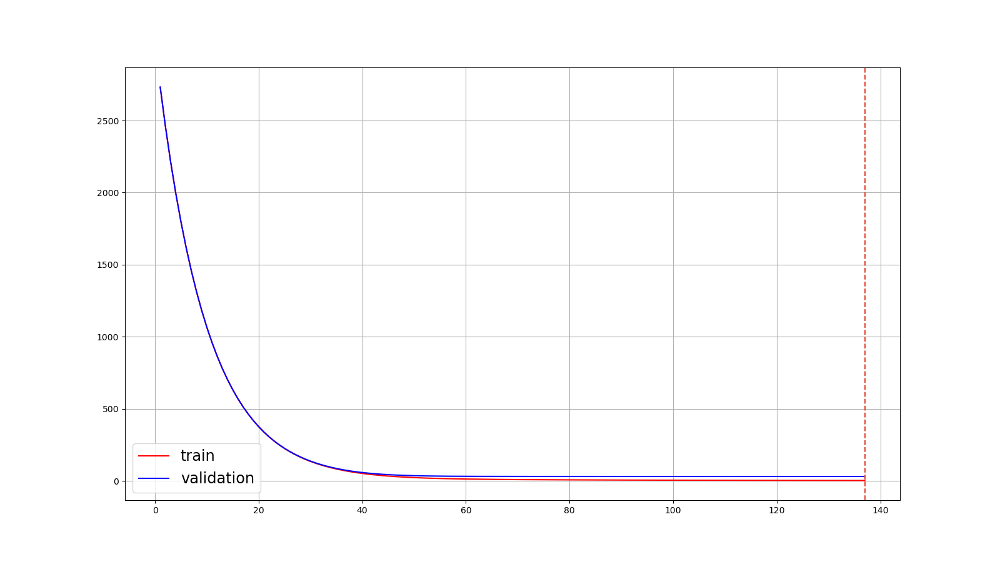

Figure 11: the rooted mean square error on the train and validation dataset

Feature importance is shown by figure 12, where variables like `open`, `SPX_pct_chg`, lags of `XIN9_pct_chg`, etc., have a more considerable impact on the predictions. 

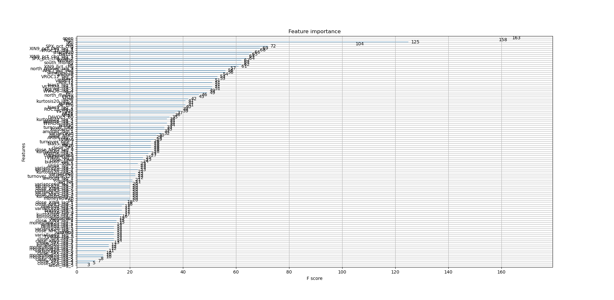

​			Figure 12: feature importance of the model

The table below lists the in-sample and out-of-sample regression errors.

Table 1: model performance 

| metrics     |  values |
| :---        |         ---: |
| in-sample mean absolute error    | 3.09 |
| in-sample mean squared error   | 16.45 |
| out-of-sample mean absolute error  | 79.16 |
| out-of-sample mean squared error  | 11211.20|

The fitted plot, as shown in figure 13, further visualizes the model's performance. The blue dots fit well at the beginning of the test set. However, as time goes by, its predictive capability deteriorates quickly. The phenomenon, typical as it is, highlights the importance of retraining the model timely.  

​			Figure 13: fixed window predictions on the test set

#### 4.2.2 Rolling window

The XGBoost Regressor is then trained using rolling windows. The metrics exhibited in table 2 show its improvement over the fixed one window. 

Table 2: model performance 

| metrics     |  values |
| :---        |         ---: |
| in-sample mean absolute error    | 0.47 |
| in-sample mean squared error   | 2.16 |
| out-of-sample mean absolute error  | 63.01 |
| out-of-sample mean squared error  | 8556.90|
| out-of-sample accuracy after labeling  | 44.60% |

Figure 14 plots the predicted value with the true ones, demonstrating its improvement over the fixed one window.

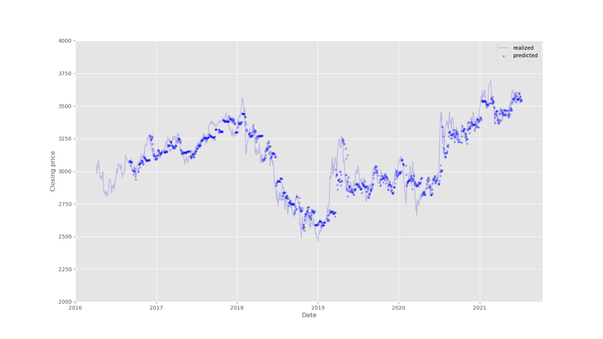

​			Figure 14: rolling window predictions on the test set

#### 4.2.3 Recursive window

Finally, the recursive window seems to give the best predictions, as it reaches an out-of-sample accuracy of 53.19%, which is the highest among all experiments in this paper.

Table 3: model performance 

| metrics     |  values |
| :---        |         ---: |
| in-sample mean absolute error    | 2.47 |
| in-sample mean squared error   | 14.98 |
| out-of-sample mean absolute error  | 39.58 |
| out-of-sample mean squared error  | 2888.93|
| out-of-sample accuracy after labeling  | 53.19% |

The fitted dots in figure 15 appear to lie more closely with their realized values. 

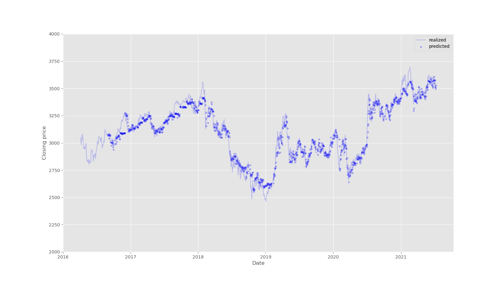

​			Figure 15: recursive window predictions on the test set

To form buying and selling signals, triple barrier labeling is again applied to the out-of-sample predictions of the XGBoost regressor. After labeling the predicted next day's closing price, the predicted label is again compared with its original ones to calculate accuracy. Figure 16 plots the accuracy of triple barrier classification based on rolling window predictions. The later formed labels have an out-of-sample accuracy of 44.60%, slightly improving previous performance. 

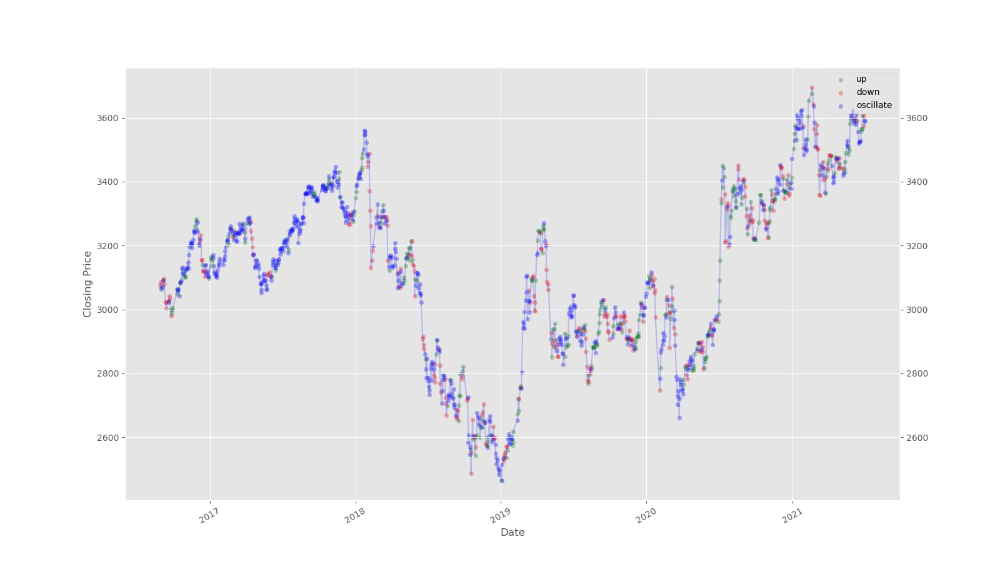

​			Figure 16: triple barrier label based o rolling window XGBoost regression

Figure 17 plots triple barrier labels which are formed on the recursive window regression's results. The result is rather satisfactory as it reaches an out-of-sample trinary classification accuracy of 53.19%. As can be seen from the plot, a sequence of green dots appear at the rising states while the red ones cluster at the falling states, validating its reasonability.

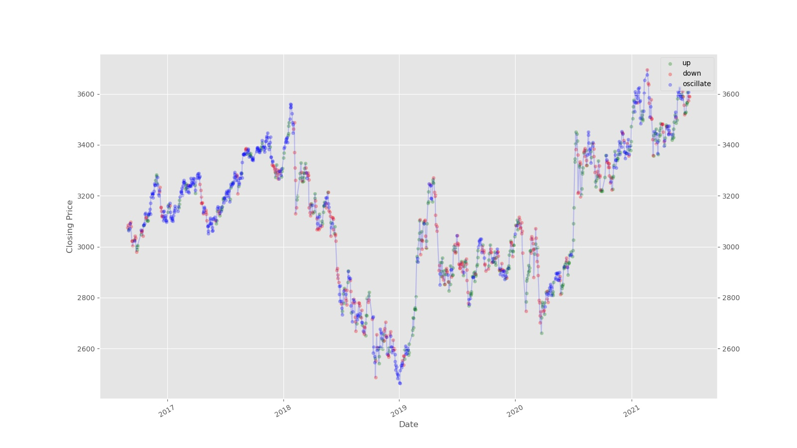

Figure 17: triple barrier label based on recursive window XGBoost regression

To further validate its predictive capability, backtest is conducted based on the triple barrier labels. The initial position is set to be 10000 in cash, the label of `1` is a buying signal, while `-1` for selling, `0` nothing will be done. All the buying and selling is conducted if only the cash or stock inventory is enough. The transaction is made at the market opening, using open prices. The transaction fees of buying are set to be 0.05% and 2% if selling. 

Figure 18 plots the net value of the strategy. As can be seen clearly, it outperforms the buy-and-hold strategy significantly, and its return tends to be persistent, accumulating steadily over time. The strategy has an annualized Sharpe ratio (SR) of 1.29 and a max drawdown ratio (MDR) of 8.39%, indicating its superiority. 

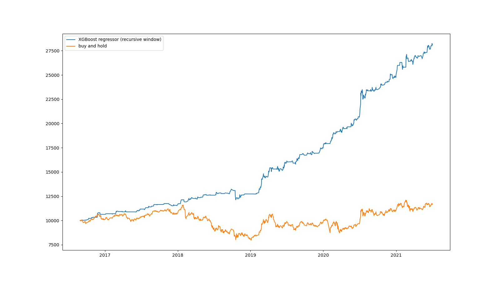

Figure 18: strategy performance of XGBoost regressor on recursive windows

## 5. Conclusion

In conclusion, using the XGBoost classifier and regressor, we have found predictive features to time the SSE composite index. The XGBoost regression on recursive windows seems to offer the best performance, from which signals are formed, yields an annualized Sharpe ratio of  1.29 and a max drawdown ratio of 8.39 %, considering hefty transaction fees. 

table 4: model performance, in summary

| window type | classification (oos acc) | regression (oos mse, oos acc) | backtest (SR, MDR) |
| :---        |    :----:   |  :---: |    ---: |
| fixed one      | 43.00% | 11211.20, --- |      |
| rolling   | 43.22% | 8556.90, 44.60% |      |
| recursive  | 43.47% | 2888.93, 53.19% |1.29, 8.39%     |

## References

Marcos L{'o}pez De Prado, 2018. Advances in Financial Machine Learning. John Wiley & Sons, Inc.

## Codes and Datasets

For codes and datasets, please visit our [github repository](https://github.com/Yikiwi13/HMM-GMM-Timing-Strategy/tree/XGB). Any corrections or suggestions are highly appreciated.

## Declarations

This project is completed with the joint effort of [Likelihood Lab](http://maxlikelihood.cn) members, supported by Guangzhou Shining Midas Investment Management Co. Ltd.
